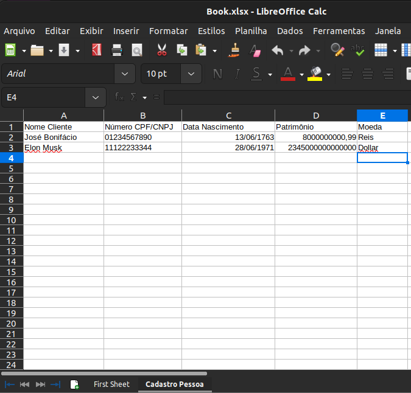
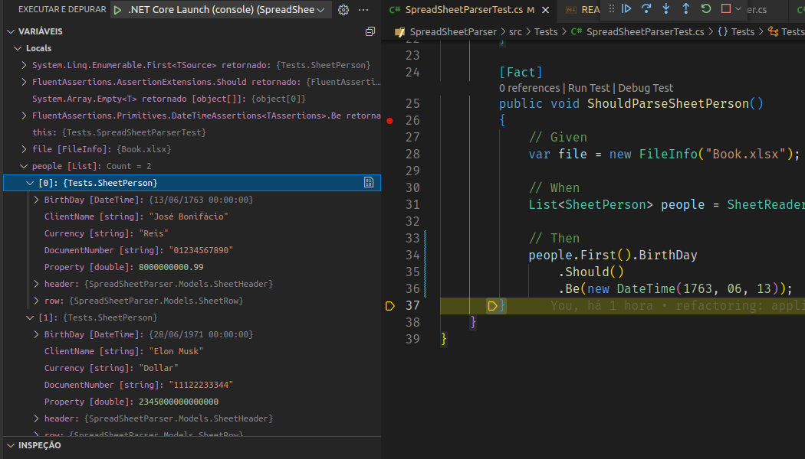

# SpreadSheetParser

## Convert your .xlsx file to a C# object and them, do what you want!

This package can help read and parse a SpreadSheet/Excel .xlsx file and return a object.


1. Choose a .xlsx file:



2. Make a class to represent this sheet

````csharp
    [DisplayName("Cadastro Pessoa")]
    public class SheetPerson : SheetObject
    {
        [DisplayName("Nome Cliente")]
        public string ClientName { get; set; }

        [DisplayName("Número CPF/CNPJ")]
        public string DocumentNumber { get; set; }

        [DisplayName("Data Nascimento")]
        public DateTime BirthDay { get; set; }

        [DisplayName("Patrimônio")]
        public Double Property { get; set; }

        [DisplayName("Moeda")]
        public string Currency { get; set; }

        public SheetPerson(SheetHeader header, SheetRow row) : base(header, row)
        {
            if (TryBuildObject<SheetPerson>(this) is false)
                throw new ArgumentException("Could not create a sample object");
        }
    }
````

> Pay attention to the DisplayNameAttribute, we are using this to infer the sheet name and the table header columns name.

> Make sure the type of the properties is exactly the same of the spread sheet column.

The first row in the sheet is used as a Header, each column must always be a string in this row.

3. In the constructor, you have to use the base method "TryBuildObject<YourClass>(this)", it will try to create a object using reflection.

4. Now, you can create a SheetFile<YourClass>:


````csharp
using SpreadSheetParser.Models;

[Fact]
public void ShouldParseSheetPerson()
{
    // Given
    var file = new FileInfo("Book.xlsx");

    // When
    List<SheetPerson> people = SheetReader.ReadStream<SheetPerson>(file.OpenRead());

    // Then 
    people.First().BirthDay
        .Should()
        .Be(new DateTime(1763, 06, 13));
}
````

5. The result should be like this:



This component reads just one sheet per builder, if you want to read multiple sheet, use a builder to each one.